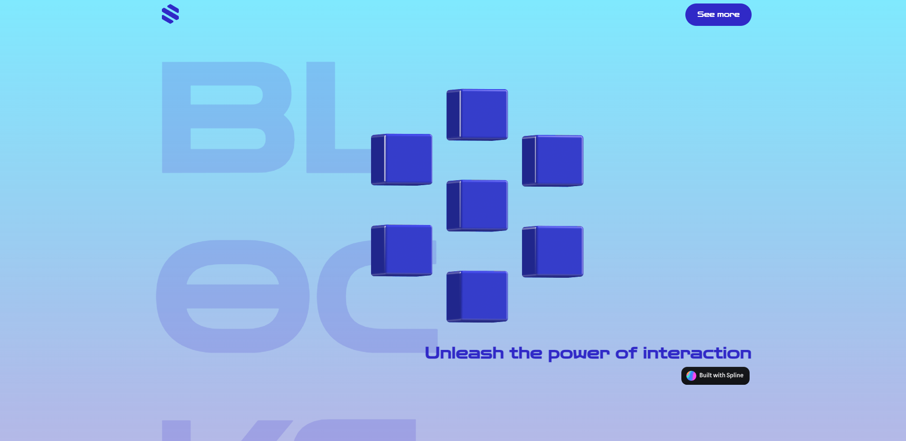

<p align='center'></p>
<h1 align='center'>Blocks</h1>
<p align='center'>


</p>

## 🔖 Descrição
<p>📋 Criação de uma página fazendo uso do Spline, criando elementos 3D interativos.

## 🚀 Tecnologias
Esse projeto está utilizando as seguintes tecnologias:
- HTML
- CSS
- [Spline](https://spline.design/)
- [GSAP](https://gsap.com/)

## 🎲 Como utilizar
```bash
# Clone esse repositório
$ git clone https://github.com/rafaasimi/blocks-frontweek.git

# Navegue até o repositório
$ cd blocks-frontweek

# Abra o HTML
$ index.html
```
<h3>🖼 Layout</h3>


---
<p>Criado com 💙 por <a href='https://github.com/rafaasimi/' target='_blank'>Rafael Simionato</a></p>